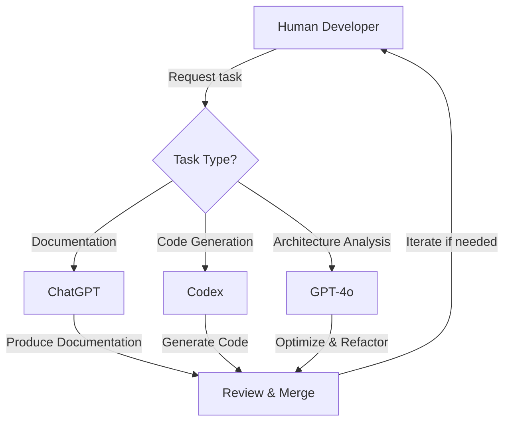

# 🤖 Responsibilities

| Task/Feature                      | Primary Agent | Supporting Agent | Notes                                       |
|-----------------------------------|---------------|------------------|---------------------------------------------|
| Writing documentation (like KDoc) | ChatGPT       | Codex            | Use for readable, structured docs.          |
| Explaining APIs and architecture  | ChatGPT       | -                | Great for clarity in team workflows.        |
| Code generation (e.g., tests)     | Codex         | ChatGPT          | Codex produces quick scaffolding.           |
| Code refactoring suggestions      | ChatGPT       | Codex            | Use ChatGPT for design-level improvements.  |
| Completing functions or classes   | Codex         | -                | Codex is better for direct completions.     |
| Debugging and test suggestions    | ChatGPT       | Codex            | ChatGPT suggests missing scenarios.         |
| Advanced architecture analysis    | GPT-4o        | -                | Best for complex CQRS pattern optimization. |
| Kotlin idiom optimization         | GPT-4o        | Codex            | Leverages latest language features.         |

## Agent collaboration workflow



*Note: The diagram shows the typical workflow and which agent to use for different task types.*


## Tagging pull request messages

Use PR tags for clarity:
```text
feat(chatgpt): Updated README with clearer KDoc examples
fix(codex): Completed missing `when` branches in tests
perf(gpt-4o): Optimized event processing pipeline
```
### Why tag pull requests?
Tagging PRs helps the team:
  - Track which agent contributed to specific changes.
  - Understand whether a PR needs extra human review based on the agent's role.
  - Make decisions about multi-agent collaboration in reviews.

## Selecting the right Agent

<details>
<summary>Click to expand the decision tree for agent selection</summary>

```
Is the task primarily documentation or explanation?
├── Yes → Use ChatGPT
└── No → Continue

Is the task primarily generating boilerplate code or tests?
├── Yes → Use Codex
└── No → Continue

Does the task involve complex architectural decisions or advanced Kotlin features?
├── Yes → Use GPT-4o
└── No → Use ChatGPT for analysis, then Codex for implementation
```

**Task examples by Agent:**

- **ChatGPT**: Documentation, conceptual explanations, architectural insights
- **Codex**: Code generation, test scaffolding, completing partially written code
- **GPT-4o**: Advanced architectural patterns, Kotlin idiom optimization, complex refactoring

</details>
